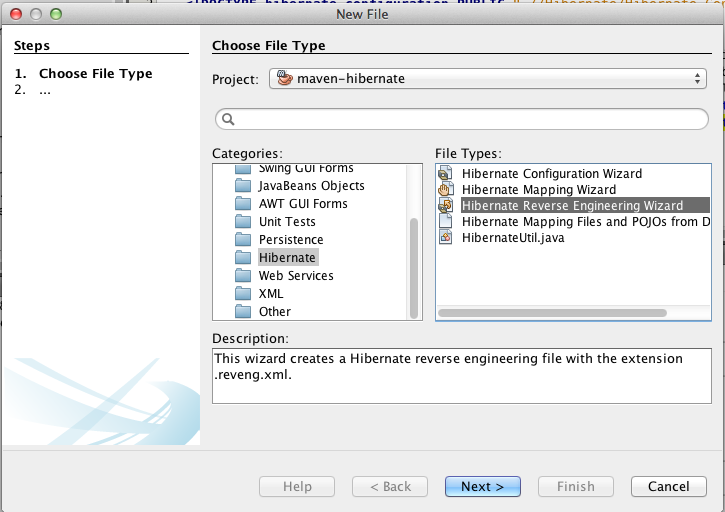
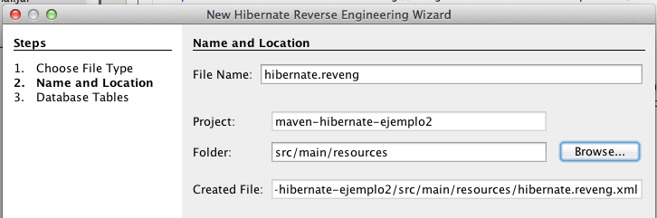

##Netbeans - Herramienta de ingeniería inversa para Hibernate.

El siguiente proceso permite generar un modelo de clases base (con imperfecciones, y que debe ser ajustado) a partir de una conexión de base de datos suministrada.

1.  Use el asistente de creación de archivos de configuración Hibernate, y conéctese a la base de datos usada para el ejercicio anterior.

	

2.  Siguiendo las convenciones de Maven, este archivo debe quedar en la ruta /src/main/resource.

    

    
    
3.  Antes de finalizar la creación del archivo, verifique que los parámetros permitan la conexión con “Test Connection”:

	

1.  Una vez tenga la conexión, ingrese de nuevo a la opción de nuevo archivo/ asistente de ingeniería inversa para Hibernate:

	

1.  Asegurese de que la ruta del archivo “reveng”, siguiendo la convención de Maven, quede en src/main/resources.

    

2.  Si todo funciona correctamente, el asistente le debe permitir elegir las tablas de la base de datos. Seleccione aquellas a las que les va a realizar ingeniería inversa:

    

3.  Seleccione la opción de generación de POJOs a partir de la base de datos:

	

1.  Seleccione sólo la generación de código de dominio con anotaciones. Adicionalmente, establezca como nombre de paquetes algo como “edu.eci.cosw.tallerhb”:

	
	
1.  Verifique que en el paquete indicado, se hayan creado las clases
    correspondientes:

	

1. Finalmente, el modelo requiere de los siguientes ajustes:
	* Haga ‘refactor‘ a los nombres de las clases, para que éstos queden en singular.
	* Por defecto, el generador hace todas las relaciones bidireccionales. Haga que éstas sean unidireccionales, excepto en las relaciones muchos a muchos(que siempre deben ser bidireccionales). Para hacer esto suprima los get/set correspondientes de la clase hacia la cual se quiera suprimir la relación. También tenga en cuenta una relación bidireccional entre A y B se vuelve unidireccional, deja de tener sentido el atributo ‘mappedBy‘ incluido en la anotación de mapeo de una de las dos partes. Por lo tanto, debe suprimir este atributo al hacer el cambio.
	* El generador de código por defecto usa colecciones sin tipo
        (*Set, List* en lugar de *Set&lt;T&gt;, List&lt;T&gt;*). Ajuste las clases para que las todas las colecciones sean tipadas.
